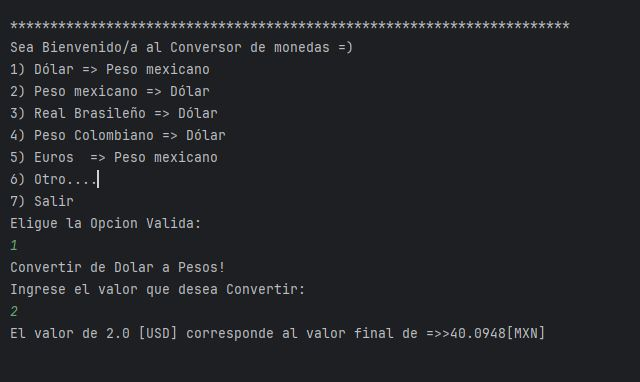
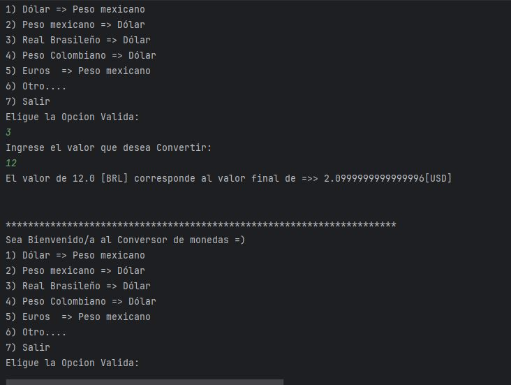
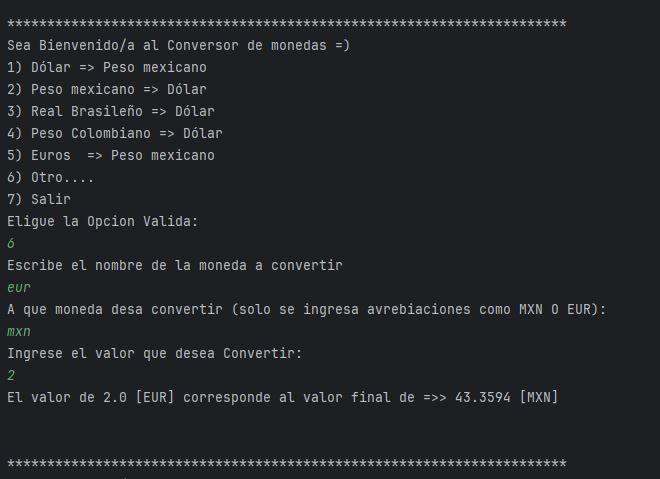

<h1 align="center"> Challenge Conversor de Monedas </h1>

## Índice

-[Índice](#índice)

-[Descripción del proyecto](#descripción-del-proyecto)

-[Estado del proyecto](#Estado-del-proyecto)

-[Características de la aplicación y demostración](#Características-de-la-aplicación-y-demostración)

-[Tecnologías utilizadas](#tecnologías-utilizadas)

-[Personas-Desarrolladores del Proyecto](#personas-desarrolladores)

-[Conclusión](#conclusión)

##  Descripción del proyecto.
Los cursos de formación de desarrollador Back-End se centran en el lenguaje de programación Java. Se aprendieron los fundamentos, la lógica de programación y la Programación Orientada a Objetos. Esto permitió aprender otros elementos importantes, como trabajar con listas o colecciones de datos, consumir API's y utilizar bibliotecas como Gson para el mapeo de datos JSON a objetos Java. El objetivo de este desafío es consumir una API que permita obtener el valor de diferentes monedas y realizar la conversión a la moneda deseada.

##  Estado del Proyecto
El proyecto se encuntra finalizado.

##  Características de la aplicación y demostración 

-  La aplicación dispone de una interfaz de texto a través de la consola, lo que nos permite interactuar con el usuario.
  

    
  
 

- La aplicación dispone de una interfaz de texto a través de la consola, lo que nos permite interactuar con el usuario.Para que el usuario pueda consultar el valor de una moneda tantas veces como desee, se incluyó el menú y sus funcionalidades en un bucle. El usario debe de reallizar las siguientes instrucciones para poder lograr la conversion.
  - Cunado se muestra el mensaje de eleguir una opcion valida, tendra que introducir el numero que mas le interese de la lista de opciones.
  - Posteriormente introducir la cantidad que prefiera para llevar a cabo la conversion.
  

    
  

  
- El menú ofrece diversas opciones para que el usuario seleccione la más adecuada a sus necesidades. Si no encuentra la opción deseada, puede introducir la abreviación de la moneda que busca y, si está disponible, podrá realizar la conversión a la moneda que introduzca, proporcionando la cantidad a convertir.

  

##  Tecnologías utilizadas
|Librería|Lenguaje|IDE|
|:----------:|:--------:|:---:|
|Gson|Java|IntelliJ 2024|

##  Personas-Desarrolladores del Proyecto
-  Desarrollado por Alejandra López
##  Conclusión
Realizar este proyecto fue la forma adecuada de aprender los temas vistos en clase. Es importante resaltar la importancia de planificar los objetivos o metas utilizando herramientas como Trello, y posteriormente realizar un análisis, implementación y prueba de los componentes establecidos en tu lista de objetivos.
